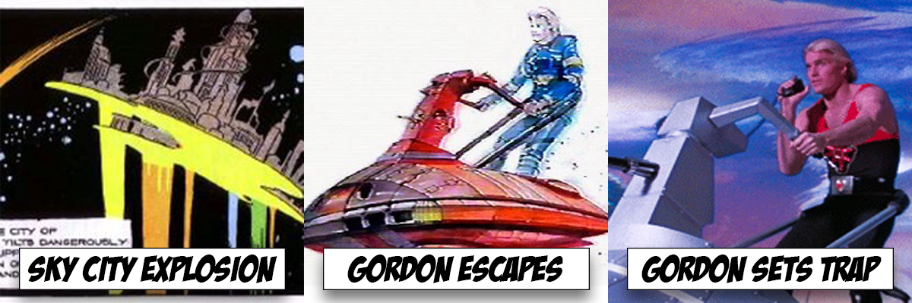

# Games Engines 2 Project
## Flash Gordon

## Description
For my Games Engines 2 Project I will be basing my application off of the popular 1980s movie Flash Gordan. The application will start off halfway through the movie when Flash Gordon is attacked by Emperor Ming in Sky City. The Hawk men have just abandoned their home world and Emperor Ming destroys the city with Flash Gordon still inside. Flash escapes in the nick of time on a hovercraft inside of Sky City and goes to get his revenge on Emperor Ming. Flash Gordon travels to the planet of mongo and lures the Emperor Mings Space Ship AJAX into a trap as he appears to be alone on his hovercraft.  Waiting for AJAX is Prince Vultan and the hawkmen who are ready to attack the Space Ship AJAX. After successfully batteling Emperor Mings army and taking over the Space Ship the final part of the plan is to fly AJAX into Emperor Mings Tower on the planet Mongo. A lightning field is guarding Emperor Mings Tower making the task seem impossible until the lightning field is disabled by an ally. This allows Flash Gordon to crash AJAX into Emperor Mings Tower which eventually leads to Mings Demise.

## Instructions
In order to use this project the application must be cloned and opened in unity preferably using version 2019.3.0a4 or later. There is no additional equipment needed.

## How it works
Scripts are written so that each scene will seemlessly transition to the next scene. The project starts in scene one beginning with flash escaping the sky city. it will transition into scene 2 an 3 without any user input. When scene four finishes the user will have to stop the application. During each scene the camera can be moved but it is not necessary to do so.

## What I am most proud about in the assignment
I am very proud of the assets and the enviroment created in this project. The majority of the assets were created from scratch replicationg important features in the Flash Gordon Movie. This also included the smallest animations such as the the wings moving on the hawk men and the creation of the hawk men from different assets. I was also very proud of how I got the lightning field to work in the final scene finding an object for an epicenter and using it to gyrate around the chosen position in a stochastic fashion.

## For this project I am creating my own assets or modifying online assets

## StoryBoard

## Youtube Video

## Assets not created by me
All music in \Assets\Music
The following Blender Files
- \Assets\spaceship
- \Assets\starfield skybox
- \Assets\Space Assets\flash gordon\ Helmet_-_High_Poly
- \Assets\Space Assets\flash gordon\ rifle futuristic suppressed 008 
- \Assets\Space Assets\Winged Man\ Spartan_Warrior (edited)
- \Assets\Space Assets\Winged Man\ WingsRender (edited)

## Scripts not written by me
The Freecam script is the only script which is not created by me.

## Every other Script and assets was created or recreated by me.
